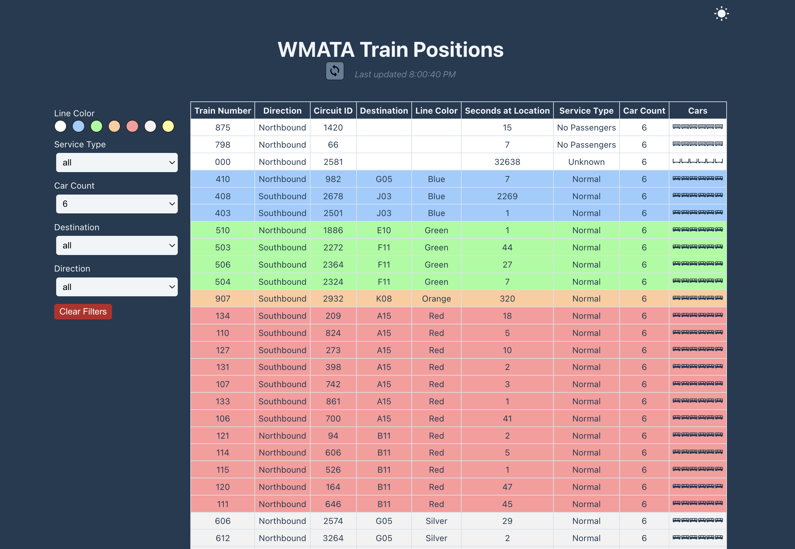
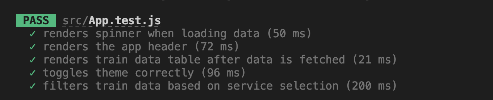

# Train Tracker App

`Train Tracker` is a react app that tracks the real-time positions and details of WMATA trains in Washington D.C.

## User Stories (Original Requirements)

- As a user I'd like to be able to see all the trains!
- As a user I'd like to be able to filter by train line color.
- As a user I'd like to be able to filter by different service types.
- As a user I'd like to be able to filter by car count.
- As a user I'd like to be able to visually distinguish trains on different colored lines from each other.
- As a user I'd like to be able to visually distinguish between different car counts.
- As a user I'd like to be able to distinguish trains by different service types.
- As a user I'd like to see the page automatically update as the trains' positions update.

## Key Functionalities
#### 1. Real-time Train Positions:
- Fetch and display live train positions from the WMATA API.
- Update the train positions automatically at regular (2 minutes) intervals.
- Users can manually refresh the displayed train positions with the latest data by clicking the `refresh` icon.
- The `Last Updated` field clearly displays the time the train position data was last fetched.
- Provide clear and concise information about each train, including: Line Color, Train Number, Car Count, Service Type, Direction, Destination Station, Seconds At Location.

#### 2. Train Visualization:
  Display trains with clear visual indicators for:
- `Line Color`: Trains are represented on rows colored according to their respective lines.
- `Car Count`: Number of the train icons directly reflects the number of cars on each train.
- `Service Type`: Different train icons indicate different service types.

#### 3. Train Filtering:
- Allow users to filter the displayed trains by: `Line Color`, `Service Type`, `Car Count`, `Destination`, and `Direction`.
- Provide clear and intuitive filter controls.
- Implement `Clear All Filters` functionality.

#### 4. Accessibility:
- Implement accessibility best practices to ensure the application is usable by everyone, regardless of their abilities.
- Personalize your page with the option to switch between `light` and `dark themes`.
- Use appropriate semantic markup: `main`, `header`, `section`, `nav`, etc. 
- Use clear and consistent labeling for all UI elements.

#### 5. Data Management:
- Indicate empty/loading/error states.
- Cache train position data locally to improve performance and reduce API calls.

## SEO Optimization
- Semantic HTML and appropriate heading tags were used to help search engines understand the organization of the content.
- Include a `<title>` that accurately describes the page content.
- Include relevant meta tags such as viewport, description, and keywords in the `<head>` section of the HTML document. 

## Tech Stack
- `ReactJS`: A popular JavaScript library for building user interfaces. 
- `React Hooks`: Functions that let you “hook into” React features from function components.
- - `useState`
- - `useEffect`
- - `useMemo`
- - `useRef`
- `WMATA API`: An API that provides real-time train data for the Washington Metropolitan Area Transit Authority.
- `icones.js.org`: A website that provides free SVG icons for various use cases.

 ## Deployment
- Deploy the app to Netlify service: https://wmata-train-tracker.netlify.app/

## Testing
- Automated unit tests using React Testing Library to verify user interactions.

## Verification Plan
- [x] Verify the loading indicator is displayed while data is fetching.
- [x] Verify the refresh button triggers data fetching when clicked.
- [x] Verify the last updated timestamp is updated after data refresh.
- [x] Verify the header elements are displayed correctly with appropriate labels.
- [x] Verify each filter selection updates the displayed train data correctly.
- [x] Verify the "all" option displays all available trains.
- [x] Verify the "Clear Filters" button resets all filters to "all".
- [x] Verify the theme changes between light and dark when the toggle is clicked.
- [x] Verify the color contrast is sufficient for all text and background combinations.

## Future Enhancements
- Design a responsive interface that works well on different devices and screen sizes.
- Add functionality to handle data errors.
- Monitor app performance and address any reported issues.
- Add more RTL and E2E tests.